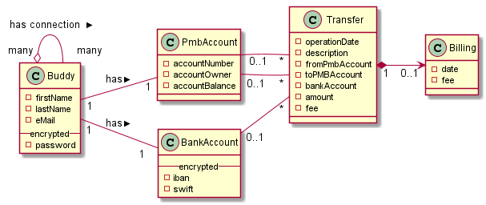
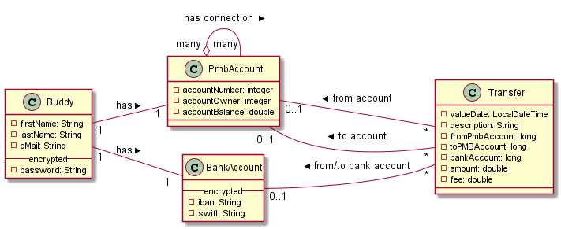

#Pay My Buddy - v0.4

###Infos
author: Thierry 'Docky' SCHREINER - DA Java student - Open ClassRooms

mentored by: Yann 'Monsieur Plus' IRRILO

release date: 07/07/2020


### Content

This v.04 release adds the Money transfer functionality with a POST request
(/sendMoney), using an orderDTO:
 
    {
        "beneficiary":"Daniel.Craig@JamesBond.fr",
        "amount":350
    }

Previous version content:
- Authentication that provides a Json Web Token (activity period 20 minutes).
- GET - http://localhost:8080/welcome
- Sign-up endpoint -> POST - http://localhost:8080/registration
- Bank account creation -> POST - http://localhost:8080/bank-account
- Add a connection -> POST - http://localhost:8080/connection
- See list of connections -> GET - http://localhost:8080/connection
- Remove a connection -> DELETE - http://localhost:8080/connection/{email}


### Database

USE pmb_sendmoney;

INSERT INTO buddy VALUES(1,1,1,1,"Al.Pacino@Hollywood.com",1,"Al","PACINO","$2a$10$Hthi7BOT2.Ez1nQkrf56.Ozia.pJRWNXnRtgf0gekoqn1qHxT0pIi");
INSERT INTO buddy VALUES(2,1,1,1,"Jean.Gabin@PatheCinema.fr",1,"Jean","GABIN","$2a$10$Hthi7BOT2.Ez1nQkrf56.Ozia.pJRWNXnRtgf0gekoqn1qHxT0pIi");
INSERT INTO buddy VALUES(3,1,1,1,"Kevin.Spacey@Holliwood.com",1,"Kevin","SPACEY","$2a$10$Hthi7BOT2.Ez1nQkrf56.Ozia.pJRWNXnRtgf0gekoqn1qHxT0pIi");
INSERT INTO buddy VALUES(4,1,1,1,"Brad.Pitt@Ocean11.cine",1,"Brad","PITT","$2a$10$Hthi7BOT2.Ez1nQkrf56.Ozia.pJRWNXnRtgf0gekoqn1qHxT0pIi");
INSERT INTO buddy VALUES(5,1,1,1,"Angelina.Jolie@Ocean11.cine",1,"Angelina","JOLIE","$2a$10$Hthi7BOT2.Ez1nQkrf56.Ozia.pJRWNXnRtgf0gekoqn1qHxT0pIi");
INSERT INTO buddy VALUES(6,1,1,1,"Dustin.Hoffman@Hollywood.com",1,"Dustin","HOFFMANN","$2a$10$Hthi7BOT2.Ez1nQkrf56.Ozia.pJRWNXnRtgf0gekoqn1qHxT0pIi");
INSERT INTO buddy VALUES(7,1,1,1,"Bebel@Belmondo.fr",1,"Jean-Paul","BELMONDO","$2a$10$Hthi7BOT2.Ez1nQkrf56.Ozia.pJRWNXnRtgf0gekoqn1qHxT0pIi");
INSERT INTO buddy VALUES(8,1,1,1,"Daniel.Craig@JamesBond.fr",1,"Daniel","CRAIG","$2a$10$Hthi7BOT2.Ez1nQkrf56.Ozia.pJRWNXnRtgf0gekoqn1qHxT0pIi");
INSERT INTO buddy VALUES(9,1,1,1,"E.T@ET.com",1,"E","T","$2a$10$Hthi7BOT2.Ez1nQkrf56.Ozia.pJRWNXnRtgf0gekoqn1qHxT0pIi");
INSERT INTO buddy VALUES(10,1,1,1,"Thierry.Schreiner@hotmail.fr",1,"Thierry","SCHREINER","$2a$10$Hthi7BOT2.Ez1nQkrf56.Ozia.pJRWNXnRtgf0gekoqn1qHxT0pIi");

INSERT INTO role VALUES(789654, "USER");
INSERT INTO role VALUES(987123654, "ADMIN");

INSERT INTO buddy_role (buddy_id, role_id)
VALUES (1,789654),
(2,789654),
(3,789654),
(4,789654),
(5,789654),
(6,789654),
(7,789654),
(8,789654),
(9,789654),
(10,987123654);

INSERT INTO bank_account (id,iban,swift,owner)
VALUES (11,"FR3330002005ALPACINO0000Z25","CRLYFRPPXXX",1),
(12,"FR3330002005JEANGABIN000Z25","CRLYFRPPXXX",2),
(13,"FR3330002005KEVINSPACEY0Z25","CRLYFRPPXXX",3),
(14,"FR3330002005BRADPITT0000Z25","CRLYFRPPXXX",4),
(15,"FR3330002005ANGELINAJOLIE25","CRLYFRPPXXX",5),
(16,"FR3330002005DUSTINHOFFMAN25","CRLYFRPPXXX",6),
(17,"FR3330002005JPBELMONDO00Z25","CRLYFRPPXXX",7),
(18,"FR3330002005DANIELCRAIG0Z25","CRLYFRPPXXX",8),
(19,"FR3330002005ET0000000000Z25","CRLYFRPPXXX",9);

INSERT INTO pmb_account (id,account_balance,pmb_account_number,owner)
VALUES (20,777,"PMB0000020",1),
(21,250,"PMB0000021",2),
(22,500,"PMB0000022",3),
(23,1000,"PMB0000023",4),
(24,260,"PMB0000024",5),
(25,300,"PMB0000025",6),
(26,2500,"PMB0000026",7),
(27,749,"PMB0000027",8),
(28,963,"PMB0000028",9);

update hibernate_sequence
set next_val = 29;
 

### Conceptual Model


<div hidden>

	```
	@startuml firstDiagram
    class Buddy  {
        -firstName
        -lastName
        -eMail
        -- encrypted --
        -password
    }
    class PmbAccount  {
        -accountNumber
        -accountBalance
    }
    Left to right direction
    PmbAccount "many" o-- "  many" PmbAccount : < has connection
    Buddy "1  " --  "1" PmbAccount : > has
    class BankAccount {
        -- encrypted --
        -iban
        -swift
    }
    Buddy "1" --  "1  " BankAccount : > has
     
    class Transfer {
        -valueDate
        -description
        -amount
        -fee
    }
    PmbAccount "0..1" --  "*" Transfer : < from account
    PmbAccount " 0..1" --  "*" Transfer : < to account
    BankAccount "0..1  " --  "*" Transfer : < from/to bank account
    
	@enduml
	```
	
</div>

	


### Logical Model


<div hidden>

    ```
    @startuml logicalDiagram
    class Buddy  {
        -firstName: String
        -lastName: String
        -eMail: String
        -- encrypted --
        -password: String
    }
    class PmbAccount  {
        -accountNumber: integer
        -accountOwner: integer
        -accountBalance: double
    }
    Left to right direction
    PmbAccount "many" o-- "many " PmbAccount : < has connection
    Buddy "1  " --  "1" PmbAccount : > has
    class BankAccount {
        -- encrypted --
        -iban: String
        -swift: String
    }
    Buddy "1" --  "1  " BankAccount : > has
     
    class Transfer {
        -valueDate: LocalDateTime
        -description: String
        -fromPmbAccount: long
        -toPMBAccount: long
        -bankAccount: long
        -amount: double
        -fee: double
    }
    PmbAccount "0..1" --  "*" Transfer : < from account
    PmbAccount " 0..1" --  "*" Transfer : < to account
    BankAccount "0..1  " --  "*" Transfer : < from/to bank account

    
    @enduml
    ```
    
</div>

   


