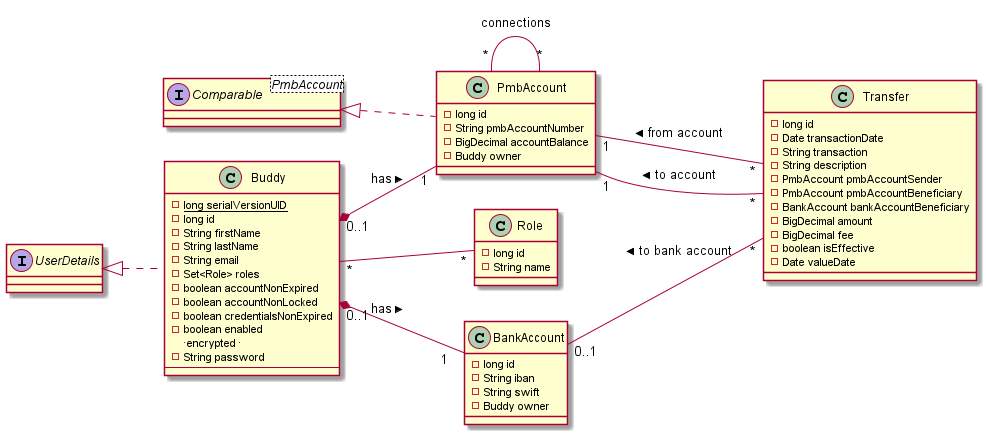

#Pay My Buddy - v1.3


###Infos

author: Thierry 'Docky' SCHREINER - DA Java student - Open ClassRooms

mentored by: Yann 'Monsieur Plus' IRRILO

release date: July, 27th 2020


### Content

The v1.3 version :
- add description field for all money transfer,
- modify@Query of List<Transfer> findByEmail(String email) to get received transfers too
- improve the security of the dataBase,
- add Beneficiary firstName & lastName in GetTransferDTO
- update diagrams in readme.md,
- improve sql scripts.

Previous version content:
- Authentication that provides a Json Web Token (activity period 20 minutes).
- GET - http://localhost:8080/welcome
- Sign-up endpoint -> POST - http://localhost:8080/registration
- Bank account creation -> POST - http://localhost:8080/bank-account
- Add a connection -> POST - http://localhost:8080/connection
- See list of connections -> GET - http://localhost:8080/connection
- Remove a connection -> DELETE - http://localhost:8080/connection/{email}
- v0.4 release adds the Money transfer functionality with a POST request
feature_getTransfer (/sendMoney), using an orderDTO:
 
    {
        "beneficiary":"Daniel.Craig@JamesBond.fr",
        "amount":350
    }

- v1.0 release adds Money deposit and withdrawal functionalities with the same
orderDTO. Deposit POST request on /pmb-adm/deposit need an admin logged user.
- v1.1 fixes the credentials kill problem after a SQL export/import due to a character encoding trouble by replacing password VARCHAR type by BINARY(60) type in buddy table.
- v1.2 use BigDecimal for money value (and decimal in database field.


### Database

The file **schema.sql** (in sendmoney/src/main/resources) contains sql instructions 
to create both prod and test databases and mandatory data.
The file **data.sql** (in sendmoney/src/main/resources) contains sql instructions 
to create some data for demonstration.

Application uses mySQL 8.0.

SendMoneyApplication deal with prod database called 'pmb_sendmoney' by credentials stored in IDE environment variables (**PMB_DB_USER = pmb-sendmoney-user**  and  **PMB_DB_PASSWORD= PazfWort_X72020!**)

The pmb_sendmoney_test database use other credentials (testeur / 1231231).


### Class diagram


<!--

    ```
    @startuml classDiagram
    class Buddy{
    -{static}long serialVersionUID
    -Long id
    -String firstName
    -String lastName
    -String email
    -Set<Role> roles
    -boolean accountNonExpired
    -boolean accountNonLocked
    -boolean credentialsNonExpired
    -boolean enabled
        -- encrypted --
    -String password
    --
    }
    interface UserDetails [[java:org.springframework.security.core.userdetails.UserDetails]] {
    }
    UserDetails <|.. Buddy


    class Role {
        -Long id
        -String name
    }

    Buddy "*" --> "*" Role

    class PmbAccount [[java:com.paymybuddy.sendmoney.moneyaccounts.model.PmbAccount]] {
        -long id
        -String pmbAccountNumber
        -BigDecimal accountBalance
        -Buddy owner
    }
    class PmbAccount [[java:com.paymybuddy.sendmoney.moneyaccounts.model.PmbAccount]] {
    }
    PmbAccount "*" --> "*" PmbAccount : connections
    interface "Comparable<PmbAccount>" as Comparable_PmbAccount_ {
    }
    Comparable_PmbAccount_ <|.. PmbAccount

    Left to right direction
    Buddy "1  " --  "1" PmbAccount : > has
    
    
    class BankAccount {
        -long id
        -String iban
        -String swift
        -Buddy owner
    }


    Buddy "1" --  "1  " BankAccount : > has
     
    class Transfer {
        -Long id
        -Date transactionDate
        -String transaction
        -String description
        -PmbAccount pmbAccountSender
        -PmbAccount pmbAccountBeneficiary
        -BankAccount bankAccountBeneficiary
        -BigDecimal amount
        -BigDecimal fee
        -boolean isEffective
        -Date valueDate
    }
    
    PmbAccount "1" --  "*" Transfer : < from account
    PmbAccount "1" --  "*" Transfer : < to account
    BankAccount "0..1  " --  "*" Transfer : < from/to bank account
   
    @enduml
    ```
    
-->

   


